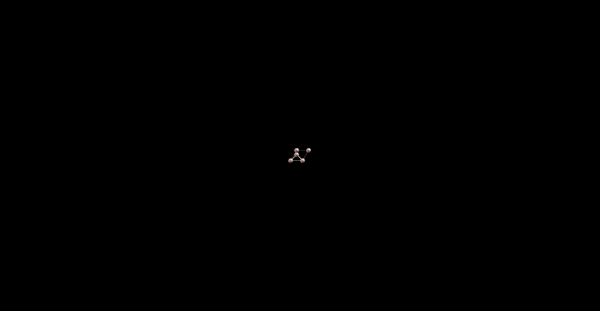

# Modelling Quantum Transport Properties
This repository contains scripts and data related to my research project under Prof. Madhav Ranganathan at IIT Kanpur. The project focuses on modelling 2D Silicene surface structure using quantum chemistry methods. It includes computational models, input files, and scripts for quantum simulations, primarily utilizing Quantum ESPRESSO.

# Silicene: Structural Optimization and Stability Analysis

**Importance of Silicene**

Silicene, the silicon-based counterpart of graphene, has garnered significant attention due to its unique electronic and structural properties. Unlike graphene, silicene exhibits a buckled honeycomb lattice, which allows for tunable band gaps under the influence of external fields. This makes silicene a promising material for next-generation nanoelectronic applications, including field-effect transistors (FETs), spintronics, and quantum computing. Additionally, silicene's compatibility with existing silicon-based technologies enhances its feasibility for integration into commercial semiconductor devices.

**Calculating Optimal Dimensions Using SCF Calculations**

To determine the most stable structure of silicene, self-consistent field (SCF) calculations are employed to minimize the total energy of the system. By systematically varying the lattice parameters and atomic positions, the SCF method identifies the configuration that results in the lowest possible energy. This step is crucial because the stability of silicene depends on achieving an optimal balance between interatomic forces and electronic interactions. The SCF calculations provide an initial estimate of the equilibrium structure, serving as a foundation for further relaxation simulations.

**Relaxation Calculations and Energy Minimization**

Following the SCF calculations, relaxation calculations are performed to refine the atomic positions and achieve a more stable configuration. This step accounts for slight displacements in atomic positions that further minimize the total energy of the system. By iteratively adjusting the structure, the relaxation process ensures that silicene attains its true equilibrium state. The final energy obtained from these calculations is typically lower than the SCF-predicted value, highlighting the significance of relaxation in accurately determining silicene’s stability. This refined structure serves as a reference for subsequent simulations involving external modifications, such as metal adsorption.

**Further Simulation Using Silver (Ag) Interaction**

To explore potential applications of silicene in device fabrication, additional simulations are conducted by introducing silver (Ag) atoms onto the silicene surface. Silver is known for its catalytic and conductive properties, making it an ideal candidate for studying silicene-metal interactions. These simulations help in understanding charge transfer mechanisms, structural modifications, and stability changes induced by Ag deposition. The insights gained from these studies are essential for optimizing silicene’s performance in practical electronic and optoelectronic applications.

# Results
The optimized bond length was found to be 3.87 Å, which is consistent with previous findings.

Optimised Strucutre Below- 

# Energy VS Lattice Value
The following graph shows the value of enrgy for the different cell lattice value. It helps us in finding the lattice value which corresponds to the minimum enrgy.
.png)
